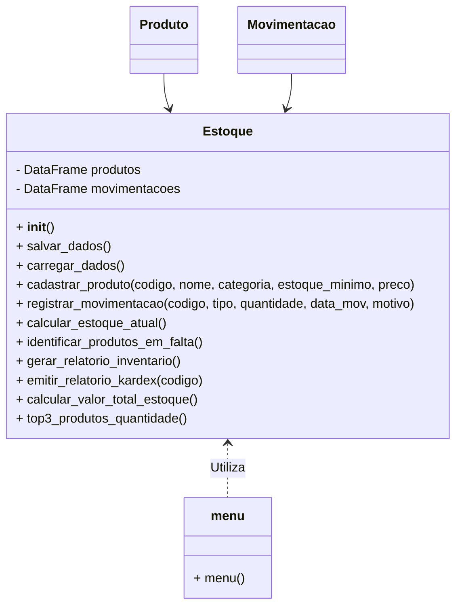

# diagramas/classe.md
## Diagrama de Contexto C4 para Sistema de Gestão de Estoque

```mermaid

classDiagram
    class Estoque {
        - DataFrame produtos
        - DataFrame movimentacoes
        + __init__()
        + salvar_dados()
        + carregar_dados()
        + cadastrar_produto(codigo, nome, categoria, estoque_minimo, preco)
        + registrar_movimentacao(codigo, tipo, quantidade, data_mov, motivo)
        + calcular_estoque_atual()
        + identificar_produtos_em_falta()
        + gerar_relatorio_inventario()
        + emitir_relatorio_kardex(codigo)
        + calcular_valor_total_estoque()
        + top3_produtos_quantidade()
    }

    Produto --> Estoque
    Movimentacao --> Estoque

    class menu {
        + menu()
    }

    Estoque <.. menu : Utiliza

```