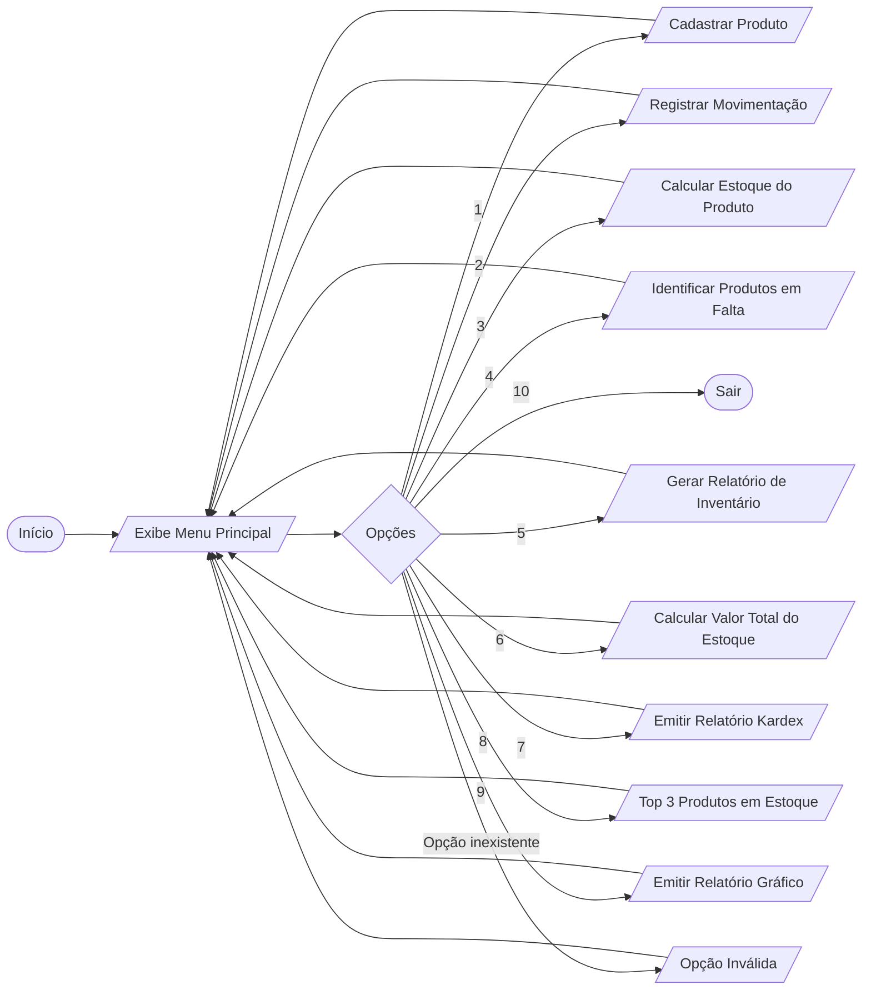

## diagramas/fluxo.md
# Fluxograma do Sistema de Gestão de Estoque

```mermaid
flowchart LR
    Start([Início])
    Menu[/Exibe Menu Principal/]
    Opcao{Opções}
    CadastrarProduto[/Cadastrar Produto/]
    RegistrarMov[/Registrar Movimentação/]
    CalcularEstoque[/Calcular Estoque do Produto/]
    ProdutosFalta[/Identificar Produtos em Falta/]
    RelatorioInventario[/Gerar Relatório de Inventário/]
    ValorTotalEstoque[/Calcular Valor Total do Estoque/]
    RelatorioKardex[/Emitir Relatório Kardex/]
    Top3Produtos[/Top 3 Produtos em Estoque/]
    RelatorioPyplot[/Emitir Relatório Gráfico/]
    Sair([Sair])
    Invalida[/Opção Inválida/]

    Start --> Menu
    Menu --> Opcao

    Opcao -->|1| CadastrarProduto
    Opcao -->|2| RegistrarMov
    Opcao -->|3| CalcularEstoque
    Opcao -->|4| ProdutosFalta
    Opcao -->|5| RelatorioInventario
    Opcao -->|6| ValorTotalEstoque
    Opcao -->|7| RelatorioKardex
    Opcao -->|8| Top3Produtos
    Opcao -->|9| RelatorioPyplot
    Opcao -->|10| Sair
    Opcao -->|Opção inexistente| Invalida

    CadastrarProduto --> Menu
    RegistrarMov --> Menu
    CalcularEstoque --> Menu
    ProdutosFalta --> Menu
    RelatorioInventario --> Menu
    ValorTotalEstoque --> Menu
    RelatorioKardex --> Menu
    Top3Produtos --> Menu
    RelatorioPyplot --> Menu
    Invalida --> Menu

```