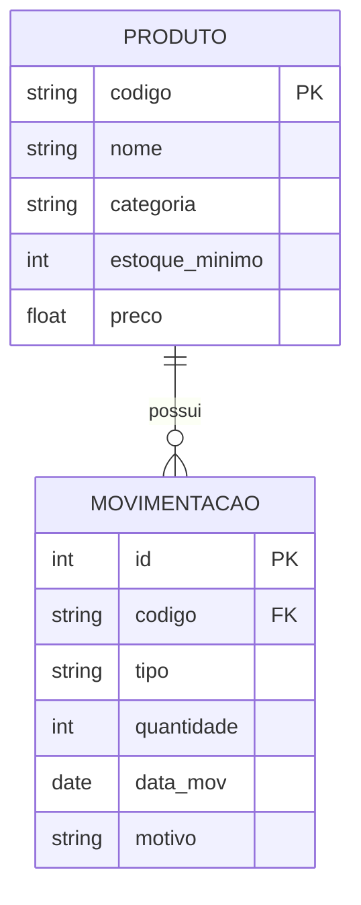

## diagramas/relacionamento.md
# Diagrama Entidade-Relacionamento (ER)

```mermaid
erDiagram
    PRODUTO {
        string codigo PK
        string nome
        string categoria
        int estoque_minimo
        float preco
    }
    MOVIMENTACAO {
        int id PK
        string codigo FK
        string tipo
        int quantidade
        date data_mov
        string motivo
    }

    PRODUTO ||--o{ MOVIMENTACAO : "possui"
    
```